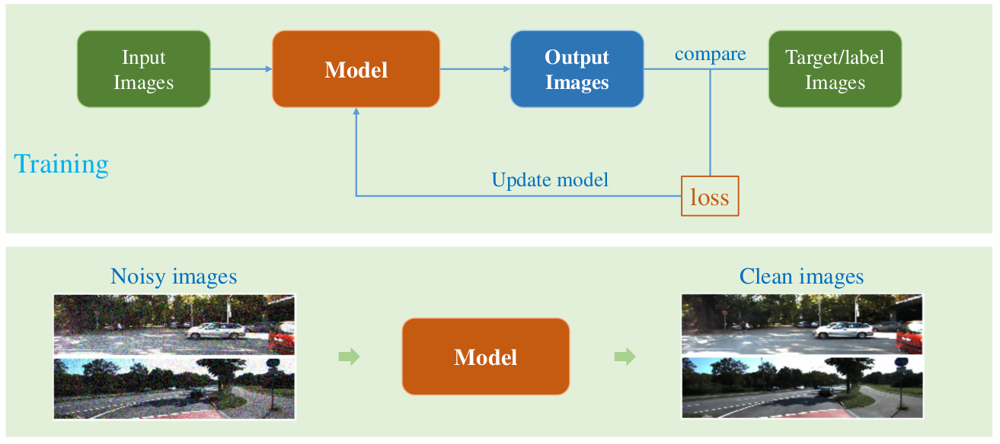
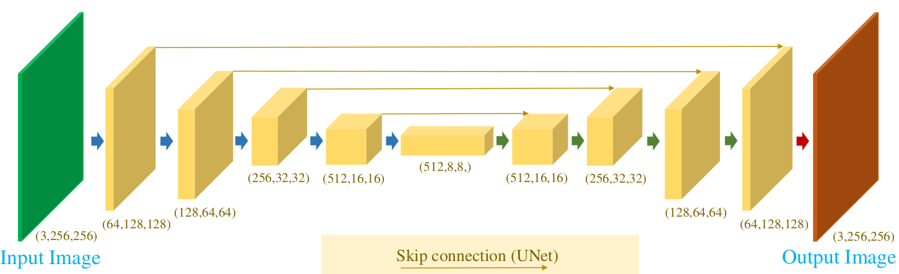
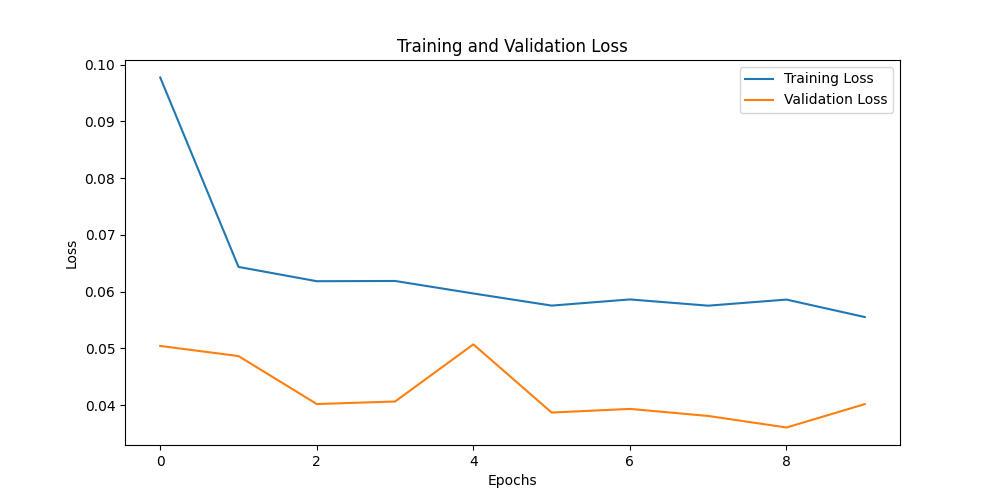
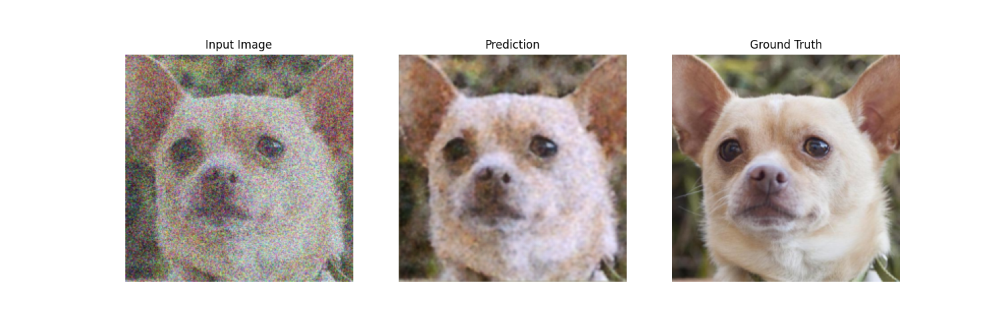
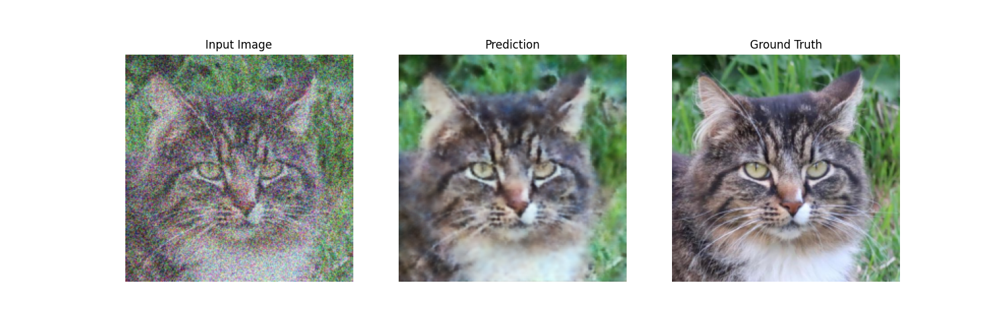
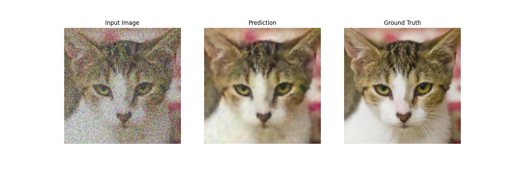
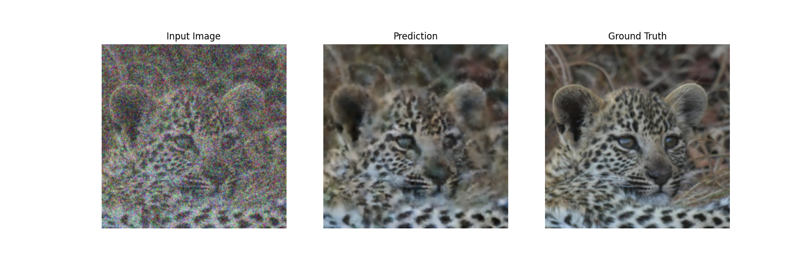
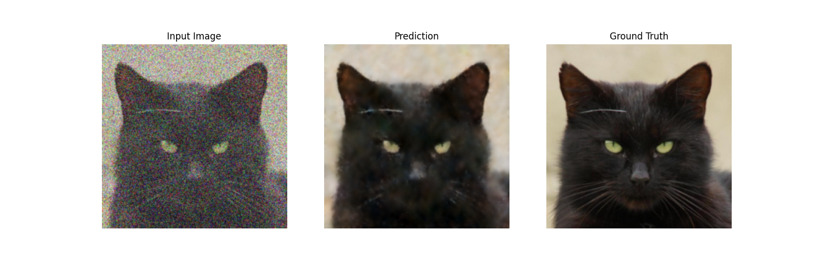
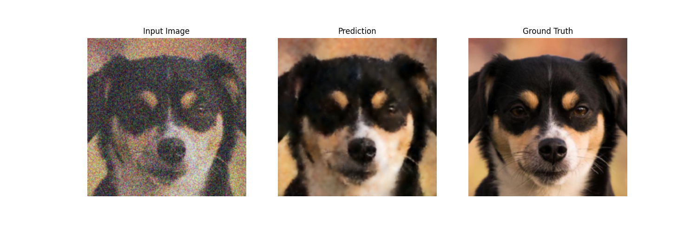

# Animal Images Denoising with U-Net

This project focuses on denoising animal face images using a U-Net architecture. The dataset is processed and augmented with Gaussian noise to create synthetic noisy images for training the model. The project includes functionalities for denoising along with instructions to extend the model for these tasks.

---

## Project Structure

### Main Folders
- **`data/`**: Contains the processed dataset (train, validation, and test splits).
  - Original dataset source: [Animal Faces Dataset on Kaggle](https://www.kaggle.com/datasets/andrewmvd/animal-faces)
  - License: [CC BY-NC 4.0](https://creativecommons.org/licenses/by-nc/4.0/)

- **`image/`**: Contains prediction results and loss plots. Example files: `test_prediction_1.png`, `val_prediction_1.png`, `loss_plot.png`

- **`model/`**: Contains the core model implementation.
  - Refer to the [README in `model/`](./model/README.md) for detailed usage.
  - Includes saved models and loaders under `model/storage`.

- **`utils/`**: Contains helper scripts for data processing and augmentation. Refer to the [README in `utils/`](./utils/README.md) for detailed explanations.

### Key Files
- **[`animal_img_denoising.ipynb`](./animal_img_denoising.ipynb)**: Jupyter notebook for experimentation and visualization.
- **[`requirements.txt`](./requirements.txt)**: List of dependencies for the project.
- **[`constants.py`](./constants.py)**: Configuration file for directory paths and constants.
- **[`LICENSE`](./LICENSE)**: Licensing information for the project and dataset.

---

## Getting Started

### Prerequisites
- Python 3.8 or later
- GPU with CUDA support (optional but recommended)

### Installation
1. Clone the repository:
   ```bash
   git clone https://github.com/letruongzzio/Animal-Images-Denoising-with-Unet.git
   cd animal-images-denoising-unet
   ```

2. Install dependencies:
   ```bash
   pip install -r requirements.txt
   ```

3. Read README files in subdirectories for detailed instructions on data processing, model implementation, and utility scripts.

### Preparation
1. Download the dataset from [this link](https://drive.google.com/file/d/1-cvQh3WWM3_lrYm3tLfpHyuexFYTnCBM/view?usp=drive_link) and extract `afhq.zip`, or you can implement as [Installation](#installation) step 3.
2. Place the extracted images into the following directory:
   ```
   ~/animal-images-denoising-with-unet/data/
   ```
   Create the folder structure if it does not exist.

3. Pre-trained model `trained_unet.pth` is available [here](https://drive.google.com/file/d/1G9y3pjZQrWBkFjc8oxpeD1wRborH2D7X/view?usp=drive_link). Download and place them into (or you can implement as [Installation](#installation) step 3):
   ```
   ~/animal-images-denoising-with-unet/model/storage/
   ```

---

## UNET Model

### Denoising Flowchart

The denoising process involves training a model to restore clean images from noisy inputs. During training, noisy images are passed through the model to produce output images, which are then compared to the corresponding clean target images using a loss function. This loss guides the model's updates to improve its performance. Once trained, the model can effectively remove noise from unseen noisy images, reconstructing clean and visually accurate outputs. This process is essential for enhancing image quality in various applications.



### Model Architecture

The U-Net architecture is a popular convolutional neural network designed for image-to-image tasks, such as denoising. It features a symmetric encoder-decoder structure with skip connections. The encoder progressively reduces spatial dimensions while capturing feature hierarchies, and the decoder restores spatial resolution. Skip connections bridge corresponding layers in the encoder and decoder, enabling the model to combine low-level details with high-level context effectively. This architecture ensures precise image restoration, making it highly suitable for denoising and other pixel-wise tasks.



---

## Results

- **Training and Validation Losses:** The model demonstrates stable training and good generalization ability, as evidenced by the decreasing and stabilizing trends of both the training and validation losses. The small gap between the losses also indicates balanced performance on the train and validation datasets. Further improvement might involve fine-tuning the learning rate or increasing the number of epochs for better convergence.



- **Denoising Results:**

  1. **Epoch 1:**
     - **Input:** The image is heavily degraded by noise, making it hard to recognize the subject clearly.
     - **Prediction:** The model shows early progress, successfully recovering the general shape and structure of the subject. However, the output remains blurry with significant artifacts.
     - **Observation:** At this initial stage, the model learns basic denoising patterns but struggles with finer details and textures.
    
  2. **Epoch 4:**
     - **Input:** The noisy input still obscures most details and textures.
     - **Prediction:** The model's performance improves, with sharper features and better restoration of details, especially in key areas like the eyes and fur texture. Background elements also show better clarity.
     - **Observation:** By this stage, the model learns to balance noise removal and detail recovery, significantly enhancing the overall quality.
    
  3. **Epoch 10:**
     - **Input:** The noise is as severe as in earlier epochs, masking the subject and background.
     - **Prediction:** The denoised output achieves better sharpness and detail retention, closely approximating the ground truth. Subtle textures and edges are more refined compared to earlier epochs.
     - **Observation:** At the final stage, the model demonstrates a mature ability to remove noise and recover intricate details, though minor smoothing artifacts persist.
    

- **Testing Results:** The test predictions illustrate the model's performance on noisy images after training. The results show a significant reduction in noise, where the predictions closely resemble the ground truth images. The key structural details and features of the animals, such as fur patterns, eyes, and facial outlines, are reconstructed effectively. However, some fine details and sharpness are still slightly missing when compared to the ground truth. These results highlight the model's robustness in denoising while retaining critical visual information.





---

## Fine-Tuning for Extension Tasks

Fine-tuning the U-Net model can be an effective approach to extend its functionality beyond denoising, such as improving image quality using **Super-Resolution**. Below is a step-by-step guide to adapt the current model for tasks like Super-Resolution:

### 1. **Adjust the Dataset**
   - Replace the noisy-clean image pairs with **low-resolution (LR) and high-resolution (HR)** image pairs.
   - **Preprocessing for Super-Resolution**:
     - Generate low-resolution images by downsampling high-resolution images using interpolation methods (e.g., `PIL.Image.resize()` or OpenCV).
     - Keep the original high-resolution images as the ground truth for training.

### 2. **Modify the U-Net Architecture**
   - **Input and Output Channels**: Ensure the U-Net's input and output channels remain compatible with the dataset (e.g., RGB images with `in_channels=3` and `out_channels=3`).
   - **Final Activation**: For Super-Resolution tasks, consider modifying the last layer’s activation function to a smoother linear activation or `Sigmoid` for normalized pixel values between $[0, 1]$.

### 3. **Loss Function**
   - Replace the Mean Squared Error (MSE) loss with **Perceptual Loss** for better visual quality:
     - Combine MSE Loss with a **VGG-based perceptual loss** to enhance feature-level fidelity in the output.
     - Alternatively, use **Charbonnier Loss** (a smooth approximation of L1 loss) for robustness.

### 4. **Training Strategy**
   - **Pretrained Weights**: Load the pretrained weights from the denoising task to initialize the model. This allows leveraging existing features and accelerates convergence.
   - **Fine-Tune Specific Layers**:
     - Start by freezing the encoder layers and training only the decoder or later layers.
     - Gradually unfreeze the encoder layers if performance plateaus.

### 5. **Adjust the Hyperparameters**
   - **Learning Rate**: Use a lower learning rate (e.g., `1e-4` or `1e-5`) for fine-tuning to prevent drastic updates to pretrained weights.
   - **Batch Size**: Super-Resolution tasks typically require smaller batch sizes due to increased memory consumption with high-resolution images.

### 6. **Evaluate and Test**
   - Use metrics tailored for Super-Resolution, such as:
     - **PSNR (Peak Signal-to-Noise Ratio)**: Measures overall fidelity.
     - **SSIM (Structural Similarity Index)**: Assesses perceptual quality.
   - Visualize the results by comparing low-resolution inputs, model outputs, and high-resolution ground truths.
